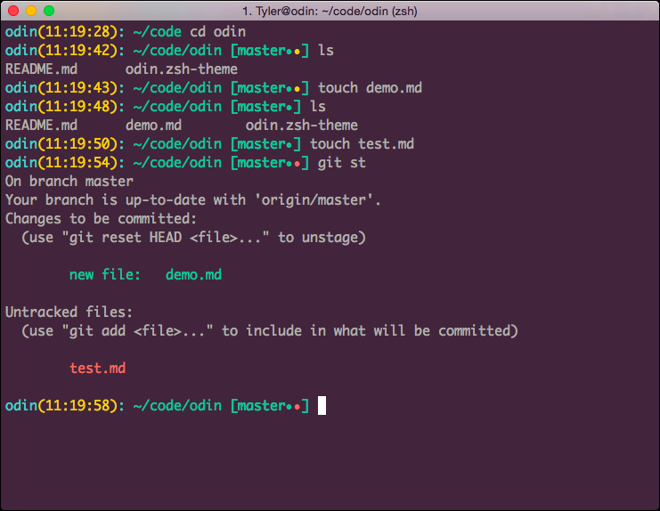

# Odin Theme  
Odin is a git flavored theme for [oh-my-zsh](https://github.com/robbyrussell/oh-my-zsh/). If you're familiar with zsh, you should be able to install the theme relatively easily. If you're not familiar, check out the zsh [documentation](https://github.com/robbyrussell/oh-my-zsh/wiki/Customization) for more info.  
  

# Features
### Detailed git information
Odin comes with extremely detailed git info built right in so that you know exactly what your status is at all times.

### Status Indicators 
◒ - Untracked files 
✚ - Files added to git
⚑ - Modified files
✖ - Deleted files
➜ - Renamed files
§ - Unmerged files
𝝙 - Repo ahead of current branch

The right side of the prompt also displays the current branch as well as the time since last commit.

# Extras
I have also included the color scheme that I have set up to work with odin. I've found this configuration to work very well and is suits my needs. Just load `odin.itermcolors` into iTerm2 and you're off. Don't have iTerm2? [Check it out](https://www.iterm2.com/) (hint: it's awesome!)

## Credits
This theme is based off of [jacobthemyth](http://github.com/jacobthemyth)'s personal zsh theme with changes made to fit my needs.
