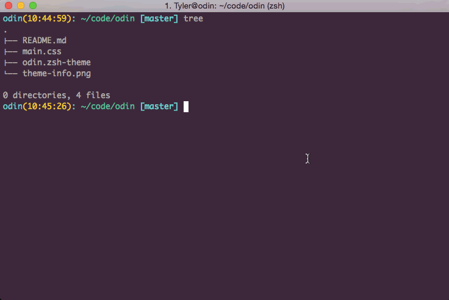

# Odin Theme  

Odin is a git flavored theme for [oh-my-zsh](https://github.com/robbyrussell/oh-my-zsh/). If you're familiar with zsh, you should be able to install the theme relatively easily. If you're not familiar, check out the zsh [documentation](https://github.com/robbyrussell/oh-my-zsh/wiki/Customization) for more info.  
  

Colors come from the amazing [Parasio Dark](http://iterm2colorschemes.com/) theme for iTerm2. Check 'em out below:  

