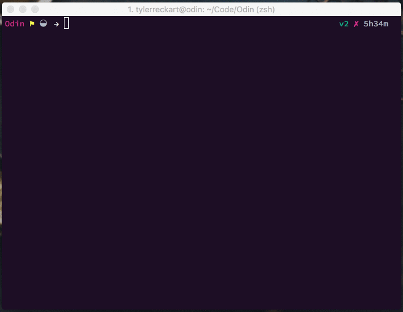
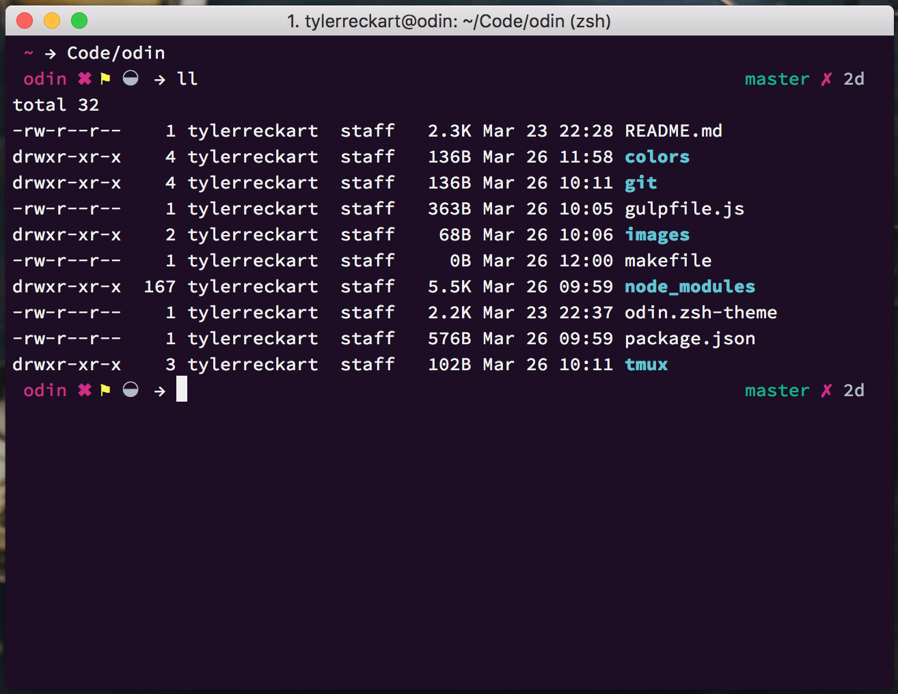
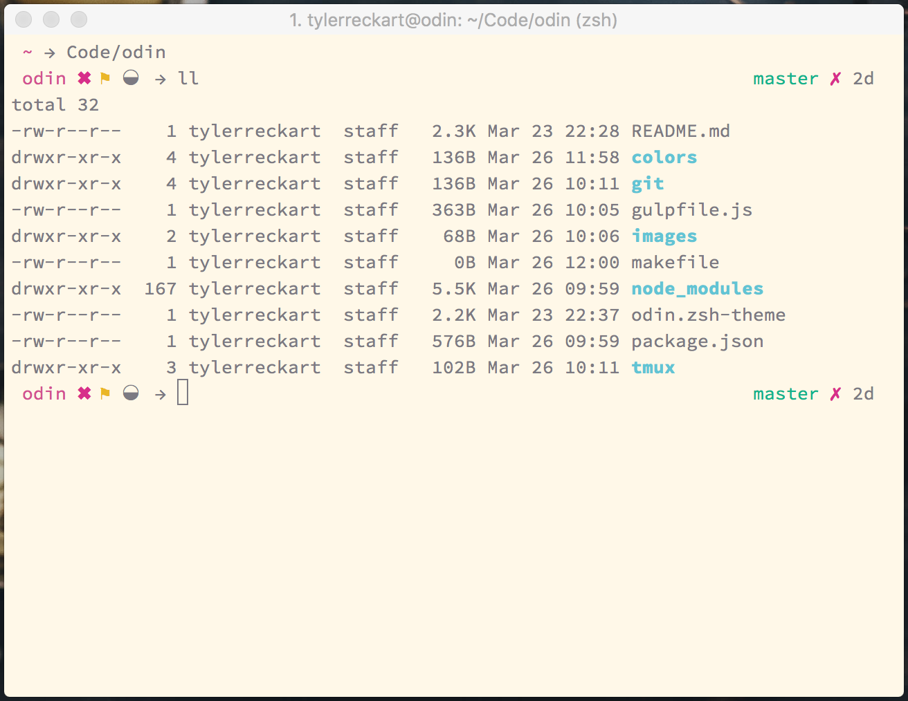

## Odin - Git flavored zsh  

Odin is a [oh-my-zsh](https://github.com/robbyrussell/oh-my-zsh) shell theme that focused around a git based workflow that provides you with a comprehensive overview of your projects status without overcrowding your shell.  

## Installation

### For [antigen](https://github.com/zsh-users/antigen) users

Add `antigen bundle tylerreckart/odin` to your `.zshrc`. Antigen will clone and load the odin repository automatically the next time you start a zsh session.

### For [oh-my-zsh](http://ohmyz.sh/) users

If you're using oh-my-zsh, follow these steps to install odin:

1. `cd zsh_custom/themes`  
2. `curl -L https://raw.githubusercontent.com/tylerreckart/odin && make`
3. Set `ZSH_THEME="odin"` in your `.zshrc`  

If you have any other issues, see the [oh-my-zsh documentation](https://github.com/robbyrussell/oh-my-zsh/wiki/Customization) for more info.  

### For [Zgen](https://github.com/tarjoilija/zgen) users

1. Add `zgen load tylerreckart/odin` to your `.zshrc` with your other `zgen load` statements  
2. `zgen save` and zgen will automatically handle cloning the repository for you.

## Color schemes  
Odin comes packaged with two color schemes, however you can customize Odin with whatever color scheme you like. Color schemes can be found in the `colors` folder.

## Options  
Odin is highly configurable. It was build to seamlessly integrate git into my workflow, but my choices may not work for you. Everything from the icons to colors are customizable to whatever you will. Want to slap some emoji in there? Go for it!

### Status Indicators  
| Variable | Indicator | Meaning |
|----------|-----------|---------|
| `ZSH_THEME_GIT_PROMPT_UNTRACKED` | ◒ | Untracked files |
| `ZSH_THEME_GIT_PROMPT_ADDED` | ✓ | Files added to git |
| `ZSH_THEME_GIT_PROMPT_MODIFIED` | ⚑ | Modified files |
| `ZSH_THEME_GIT_PROMPT_DELETED` | ✖ | Deleted files |
| `ZSH_THEME_GIT_PROMPT_RENAMED` | ➜ | Renamed files |
| `ZSH_THEME_GIT_PROMPT_UNMERGED` | § | Unmerged files |
| `ZSH_THEME_GIT_PROMPT_AHEAD` | 𝝙 | Repo ahead of current branch |
| `ZSH_THEME_GIT_PROMPT_DIRTY` | ✗ | Dirty repository |

### Right hand prompt  
The right hand prompt displays the current branch, time since last commit, as well as commit status of the repository  

| Variable | Branch Color |
|----------|--------------|
| `ZSH_THEME_GIT_TIME_SINCE_COMMIT_SHORT` | Green |
| `ZSH_THEME_GIT_TIME_SINCE_COMMIT_MEDIUM` | Yellow |
| `ZSH_THEME_GIT_TIME_SINCE_COMMIT_LONG`  | Red |
| `ZSH_THEME_GIT_TIME_SINCE_COMMIT_NEUTRAL` | Grey |

## Git  
Included in the project repo is a git folder, which contains two subfolders with git configuration settings. The config folder holds a `.gitconfig` file. This file contains all of the aliases and git settings that I use in my day-to-day workflow. Also included is a `.gitmessage` file, which allows for you to customize what you see when you make a commit. Just copy those over to your home directory and you'll be set (you'll have to fill in your info in the `.gitconfig` file to get everything working).

## [Tmux](https://tmux.github.io/) 
Odin works great with tmux. Included in the project repo is a `tmux` folder, which contains all of my preferences for utilizing tmux in tandem with Odin.

## Credits
Odin is highly inspired by [jacobthemyth](http://github.com/jacobthemyth/dotfiles)'s personal zsh shell.

Special thanks to [Joe Block](https://github.com/unixorn) for adding Odin to his list of [awesome zsh plugins](https://github.com/unixorn/awesome-zsh-plugins)

## License
The MIT License (MIT)

Copyright (c) 2015-2016 [Tyler Reckart](https://github.com/tylerreckart)

Permission is hereby granted, free of charge, to any person obtaining a copy of this software and associated documentation files (the "Software"), to deal in the Software without restriction, including without limitation the rights to use, copy, modify, merge, publish, distribute, sublicense, and/or sell copies of the Software, and to permit persons to whom the Software is furnished to do so, subject to the following conditions:

The above copyright notice and this permission notice shall be included in all copies or substantial portions of the Software.

THE SOFTWARE IS PROVIDED "AS IS", WITHOUT WARRANTY OF ANY KIND, EXPRESS OR IMPLIED, INCLUDING BUT NOT LIMITED TO THE WARRANTIES OF MERCHANTABILITY, FITNESS FOR A PARTICULAR PURPOSE AND NONINFRINGEMENT. IN NO EVENT SHALL THE AUTHORS OR COPYRIGHT HOLDERS BE LIABLE FOR ANY CLAIM, DAMAGES OR OTHER LIABILITY, WHETHER IN AN ACTION OF CONTRACT, TORT OR OTHERWISE, ARISING FROM, OUT OF OR IN CONNECTION WITH THE SOFTWARE OR THE USE OR OTHER DEALINGS IN THE SOFTWARE.
